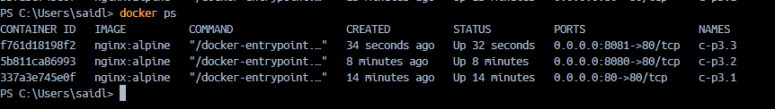

# VOLUMEN TIPO HOST
Un volumen host (o bind mount) es un tipo de volumen donde se monta un directorio o archivo específico del sistema de archivos del host en un contenedor.

```
docker run -d --name c-p3 -p 80:80 -v C:\Users\saidl\Documents\nginx\html:/usr/share/nginx/html nginx:alpine
```


### En tu computador crear una carpeta llamada nginx y dentro de esta carpeta crea otra llamada html. Como se aprecia en la figura.


### Crear un volumen tipo host con la imagen nginx:alpine, mapear todos por puertos, para la ruta carpeta host colocar el directorio en donde se encuentra la carpeta html en tu computador y para la ruta carpeta contenedor: /usr/share/nginx/html (esta ruta se obtiene al revisar la documentación de la imagen)


### ¿Qué sucede al ingresar al servidor de nginx?


Después de verificar que el contenedor estaba corriendo correctamente con docker ps, intenté acceder al servidor desde el navegador en http://localhost, pero apareció un error 403 Forbidden. Esto indicaba que Nginx no tenía permiso para acceder a la carpeta mapeada o que la carpeta estaba vacía. Revisé la carpeta C:\Users\saidl\Documents\nginx\html en mi computadora y me aseguré de que contenía al menos un archivo index.html. 
Luego, reinicié el contenedor con docker restart c-p3 y finalmente pude acceder al contenido de Nginx sin problemas.


### ¿Qué pasa con el archivo index.html del contenedor?

Al intentar acceder al servidor Nginx desde el navegador a través de http://localhost, me encontré con un error 403 Forbidden. Esto me indicó que Nginx no tenía acceso al contenido mapeado en la carpeta html. Revisé la carpeta del host y noté que estaba vacía, lo que explica el error, ya que Nginx no encontró un archivo index.html. Para solucionarlo, agregué un archivo index.html a la carpeta html del host y reinicié el contenedor con: docker restart c-p3. Luego, al refrescar la página, el contenido del archivo index.html se mostró correctamente, es decir una página en blanco, lo que confirmó que el mapeo del volumen estaba funcionando como se esperaba.

### ¿Qué sucede al ingresar al servidor de nginx?

Al descargar un template de internet, inicialmente intenté mostrarlo a través de Nginx en Docker. Sin embargo, al tener un archivo index.html en la carpeta del host junto con los archivos del template, recibí el error 403 Forbidden al acceder al servidor desde el navegador. Para solucionar esto, decidí eliminar el archivo index.html original y luego moví todos los archivos del template a la carpeta html. Después de esta modificación reinicié el contenedor con: docker restart c-p3.
Al refrescar la página en el navegador, el servidor Nginx mostró correctamente el contenido del template.


### Eliminar el contenedor

```
docker stop c-p3
docker rm c-p3
```


### ¿Qué sucede al crear nuevamente el mismo contenedor con volumen de tipo host a los directorios definidos anteriormente?

```
run -d --name c-p3.1 -p 80:80 -v C:\Users\saidl\Documents\nginx\html:/usr/share/nginx/html nginx:alpine
```

Volver a crear el contenedor con los mismos directorios definidos no afectará el contenido que se muestra, ya que la carpeta del host sigue siendo la misma y contiene los archivos necesarios del template.


### ¿Qué hace el comando pwd?

El comando pwd  muestra la ruta del directorio actual en el que me encuentro. Al ejecutarlo, me indica en qué carpeta estoy trabajando dentro de la terminal.

Si quieres incluir el comando pwd dentro de un comando de Docker, lo puedes hacer de diferentes maneras dependiendo del shell que estés utilizando.


### Volumen tipo host usando PWD y PowerShell
```
docker run -d --name c-p3.2 --publish published=8080,target=80 -v C:\Users\saidl\Documents\nginx\html:/usr/share/nginx/html nginx:alpine 
```


### Volumen tipo host usando PWD (Git Bash)

```
docker run -d --name c-p3.3 --publish published=8081,target=80 -v $(pwd -W)/nginx/html:/usr/share/nginx/html nginx:alpine
```




### Volumen tipo host usando PWD (en Linux)

```
docker run -d --name mi_contenedor --publish published=8080,target=80 -v $(pwd -W)/html:/usr/share/nginx/html nginx:alpine

```

