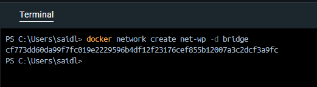
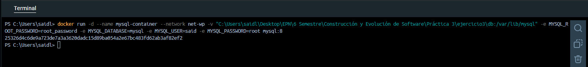
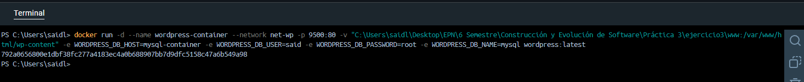
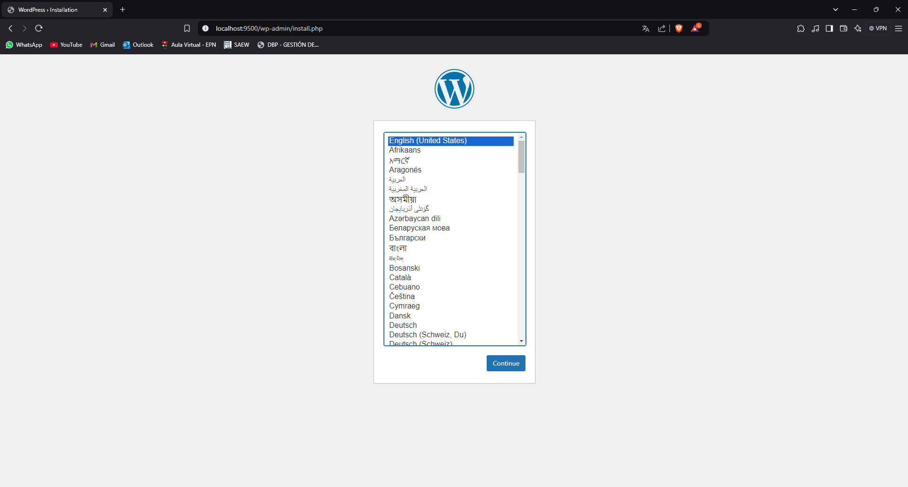
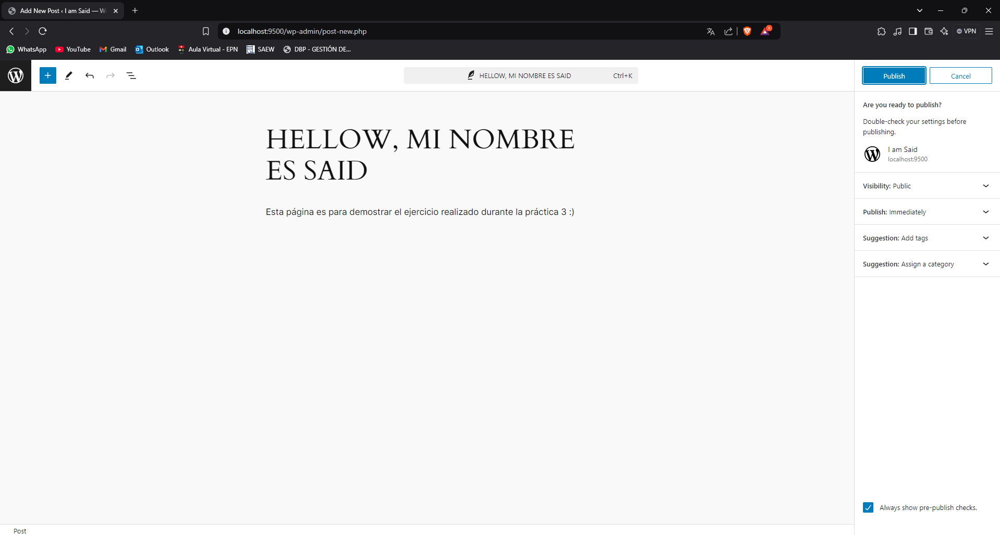
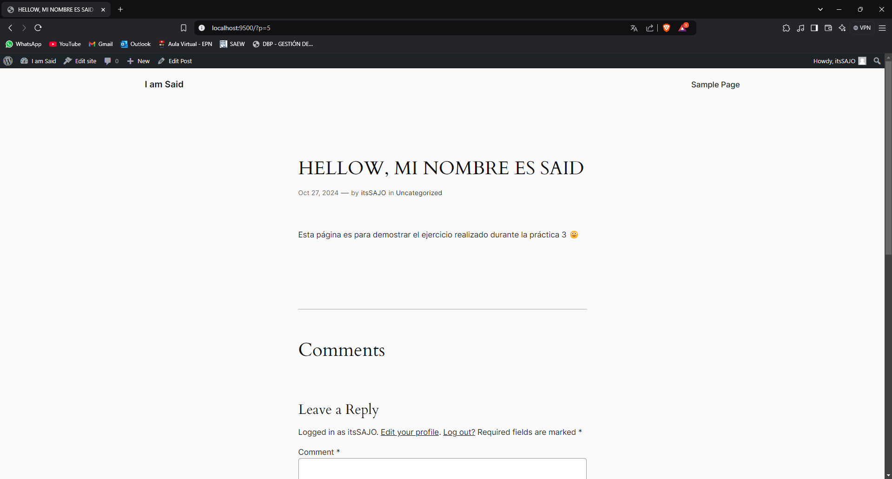
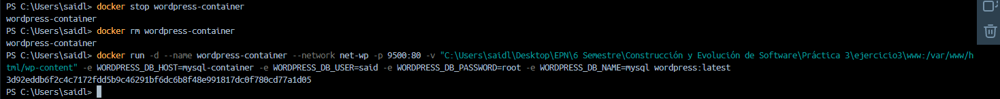
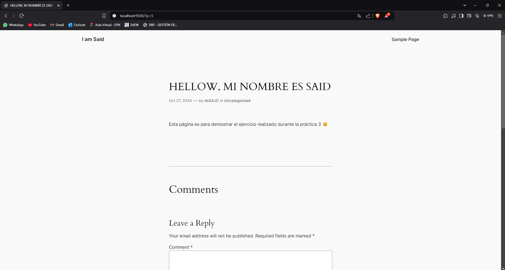

## Esquema para el ejercicio


### Crear red net-wp

```
docker network create net-wp -d bridge
```



En el esquema del ejercicio carpeta del contenedor (a) es: /var/lib/mysql

Ruta carpeta host: C:\Users\saidl\Desktop\EPN\6 Semestre\Construcción y Evolución de Software\Práctica 3\ejercicio3\db

Para que la información de MySQL persista, es necesario montar un volumen en el directorio /var/lib/mysql, que es donde MySQL almacena sus datos en el contenedor.

### ¿Qué contiene la carpeta db del host?

La carpeta db del host se encuentra vacía.


### Crear un contenedor con la imagen mysql:8  en la red net-wp, configurar las variables de entorno: MYSQL_ROOT_PASSWORD, MYSQL_DATABASE, MYSQL_USER y MYSQL_PASSWORD

```
docker run -d --name mysql-container --network net-wp -v "C:\Users\saidl\Desktop\EPN\6 Semestre\Construcción y Evolución de Software\Práctica 3\ejercicio3\db:/var/lib/mysql" -e MYSQL_ROOT_PASSWORD=root_password -e MYSQL_DATABASE=mysql -e MYSQL_USER=said -e MYSQL_PASSWORD=root mysql:8

```
Nota: La ruta completa está  entre comillas para manejar los espacios y caracteres especiales.



### ¿Qué observa en la carpeta db que se encontraba inicialmente vacía?

En la carpeta db, que al inicio estaba vacía, ahora veo varios directorios y archivos generados por MySQL. Esto incluye carpetas como #innodb_redo, #innodb_temp, mysql, performance_schema y sys, que son parte del sistema de almacenamiento de MySQL. Estos archivos y carpetas indican que MySQL está guardando los datos de manera persistente en el volumen que monté, lo que confirma que la configuración para la persistencia de datos está funcionando correctamente.

### Para que persista la información es necesario conocer en dónde wordpress almacena la información.

En el esquema del ejercicio la carpeta del contenedor (b) es /var/www/html/wp-content

Ruta carpeta host: C:\Users\saidl\Desktop\EPN\6 Semestre\Construcción y Evolución de Software\Práctica 3\ejercicio3\www

### Crear un contenedor con la imagen wordpress en la red net-wp, configurar las variables de entorno WORDPRESS_DB_HOST, WORDPRESS_DB_USER, WORDPRESS_DB_PASSWORD y WORDPRESS_DB_NAME (los valores de estas variables corresponden a los del contenedor creado previamente)

```
docker run -d --name wordpress-container --network net-wp -p 9500:80 -v "C:\Users\saidl\Desktop\EPN\6 Semestre\Construcción y Evolución de Software\Práctica 3\ejercicio3\www:/var/www/html/wp-content" -e WORDPRESS_DB_HOST=mysql-container -e WORDPRESS_DB_USER=said -e WORDPRESS_DB_PASSWORD=root -e WORDPRESS_DB_NAME=mysql wordpress:latest

```



 






### Eliminar el contenedor y crearlo nuevamente, ¿qué ha sucedido?





Eliminé el contenedor y lo volví a crear, y me di cuenta de que la persistencia de los datos ha funcionado gracias al volumen. Todos los datos almacenados en la base de datos de MySQL se mantuvieron como al incio. Al iniciar el nuevo contenedor, MySQL detectó y cargó los datos existentes sin problemas, mostrando la entrada que había configurado anteriormente.


