## VOLUMEN NOMBRADO
Un volumen nombrado (named volume) es un tipo de volumen gestionado por Docker que se almacena en una ubicación específica del sistema de archivos del host y se identifica mediante un nombre único. Los volúmenes nombrados no requieren que especifiques una ruta del sistema de archivos del host, y en su lugar, Docker se encarga de la gestión y el almacenamiento del volumen.


### Crear volumen

```
docker volume create vol-postgres
```

### Crear el volumen nombrado: vol-postgres

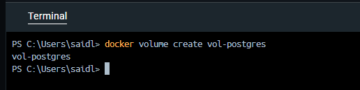

## MOUNTPOINT
Un mountpoint se refiere al lugar en el sistema de archivos donde un dispositivo de almacenamiento se une (o monta) al sistema de archivos. Es el punto donde los archivos y directorios almacenados en ese dispositivo de almacenamiento son accesibles para el sistema operativo y las aplicaciones.

Por ejemplo, en Windows las unidades de almacenamiento (como `C:`, `D:`, etc.) actúan como puntos de montaje principales para discos duros, unidades flash, unidades ópticas y otros dispositivos de almacenamiento.

Cuando creas un volumen nombrado, Docker asigna un punto de montaje específico en el sistema de archivos del host para ese volumen.

### ¿Cuál es el Mountpoint de vol-postgres?

Para obtener el Mountpoint de vol-postgres, utilicé el siguiente comando:

```
docker volume inspect vol-postgres
```
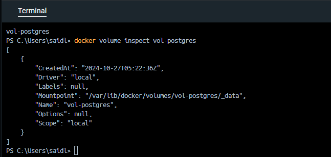

El Mountpoint de vol-postgres se encuentra en: /var/lib/docker/volumes/vol-postgres/_data


### Estructura del Punto de Montaje:
- /var/lib/docker/volumes/: Es la ubicación base donde Docker almacena todos los volúmenes en el sistema de archivos del host.
- nombreVolumen/: Es el nombre del volumen nombrado que has creado. Docker crea un directorio con este nombre dentro de /var/lib/docker/volumes/ para almacenar los datos del volumen.
- _data: Es el subdirectorio dentro de vol-postgres/ donde se almacenan los datos reales del volumen. El nombre _data es una convención utilizada por Docker para indicar el directorio donde se encuentran los datos del volumen.

### ¿Cómo acceder a ese Mountpoint?
En el contexto de WSL (Windows Subsystem for Linux), wsl$ se refiere al nombre de un recurso compartido de red especial que representa la raíz del sistema de archivos de Windows desde WSL. Cuando accedes a \\wsl$ desde el Explorador de archivos de Windows, puedes ver y acceder a los archivos del sistema de archivos de la distribución de Linux en WSL.
\\wsl.localhost\docker-desktop-data\data\docker\volumes

### Crear un contenedor vinculado a un volumen nombrado
```
docker run -d --name postgres-container -v vol-postgres:/var/lib/postgresql/data postgres:latest
```

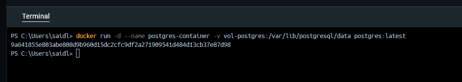

### Crear la red net-drupal de tipo bridge

```
docker network create net-drupal -d bridge
```

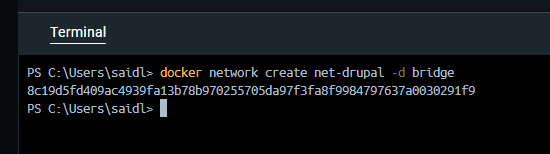

### Crear un servidor postgres vinculado a la red net-drupal, completar la ruta del contenedor
```
docker run -d --name server-postgres -e POSTGRES_DB=db_drupal -e POSTGRES_PASSWORD=12345 -e POSTGRES_USER=user_drupal --network net-drupal postgres
```
_No es necesario exponer el puerto, debido a que nos vamos a conectar desde la misma red de docker_

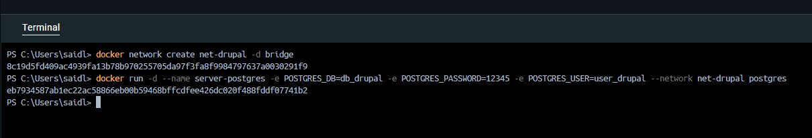

### Crear un cliente postgres vinculado a la red drupal a partir de la imagen dpage/pgadmin4, completar el correo
```
docker run -d --name client-postgres --publish published=9500,target=80 -e PGADMIN_DEFAULT_PASSWORD=54321 -e PGADMIN_DEFAULT_EMAIL=said@example.com --network net-drupal dpage/pgadmin4
```

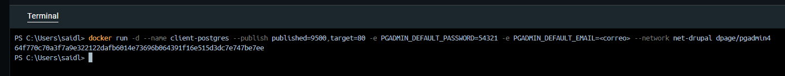

### Usar el cliente postgres para conectarse al servidor postgres, para la conexión usar el nombre del servidor en lugar de la dirección IP.

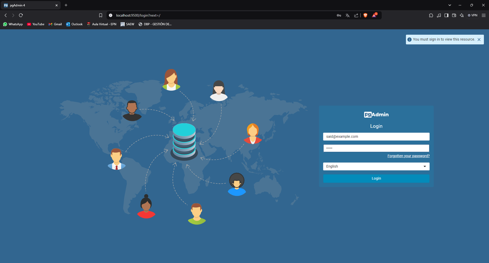

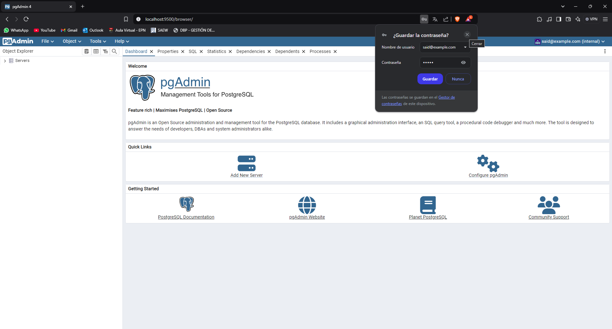

### Crear los volúmenes necesarios para drupal, esto se puede encontrar en la documentación
### COMPLETAR CON LOS COMANDOS

### Crear el contenedor server-drupal vinculado a la red, usar la imagen drupal, y vincularlo a los volúmenes nombrados
```
docker run -d --name server-drupal --publish 9700:80 -v drupal-html:/var/www/html -v drupal-config:/var/www/html/sites/default/files/config -v drupal-modules:/var/www/html/modules -v drupal-themes:/var/www/html/themes --network net-drupal drupal
```

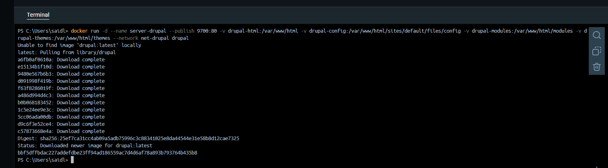

### Ingrese al server-drupal y siga el paso a paso para la instalación.
# COMPLETAR CON UNA CAPTURA DE PANTALLA DEL PASO 4

_La instalación puede tomar varios minutos, mientras espera realice un diagrama de los contenedores que ha creado en este apartado._

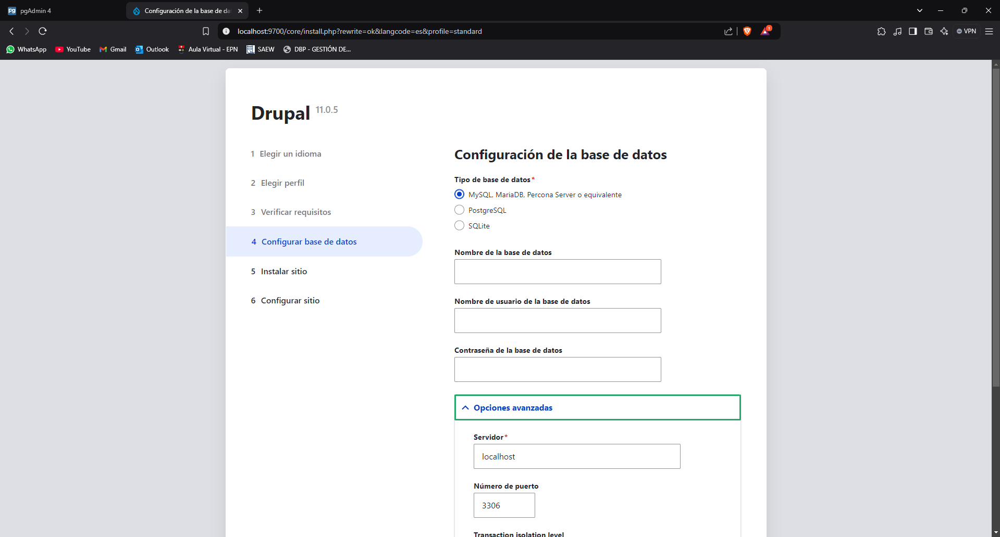 

Tuve problemas para la instalación de drupal, ara solucionar el problema de permisos durante la instalación de Drupal, primero accedí al contenedor con docker exec -it server-drupal bash. Luego, creé el directorio necesario con mkdir -p /var/www/html/sites/default/files/translations, cambié la propiedad del directorio sites/default/files a www-data con chown -R www-data:www-data /var/www/html/sites/default/files y ajusté los permisos a 755 usando chmod -R 755 /var/www/html/sites/default/files. Con esto, pude continuar la instalación sin inconvenientes.

# COMPLETAR CON EL DIAGRAMA SOLICITADO

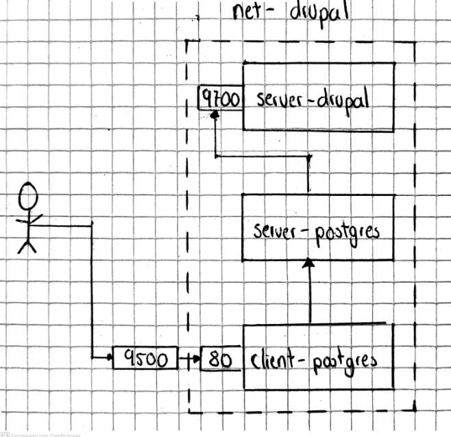

### Eliminar un volumen específico
```
docker volume rm vol-postgres
```
**Considerar**
Datos Persistentes: Asegúrate de que el volumen no contiene datos críticos antes de eliminarlo, ya que esta operación no se puede deshacer.
Contenedores Activos: No puedes eliminar un volumen que está actualmente en uso por un contenedor activo. Debes detener y/o eliminar el contenedor primero.
