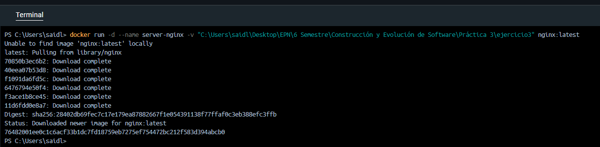
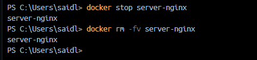
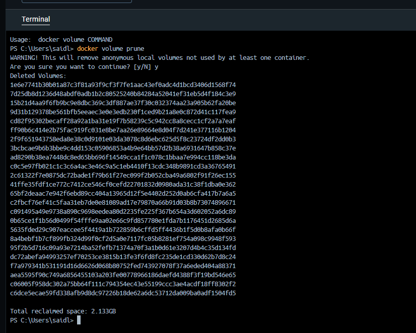

## VOLUMEN ANÓNIMO
Un volumen anónimo es un volumen que Docker crea automáticamente sin nombre específico cuando ejecutas un contenedor. Son útiles cuando deseas almacenar datos temporalmente sin preocuparte por el nombre del volumen. Docker asigna un identificador único en lugar de un nombre. Se utilizan principalmente para almacenamiento temporal. 
**Considerar**
Los datos persisten mientras el contenedor exista, pero son más difíciles de gestionar y referenciar después.

```
docker run -d --name server-nginx -v "C:\Users\saidl\Desktop\EPN\6 Semestre\Construcción y Evolución de Software\Práctica 3\ejercicio3" nginx:latest
```



### Para eliminar el contenedor y el volumen
```
docker rm -fv server-nginx
```



_esta instrucción elimina el volumen si éste es de tipo anónimo_

# Eliminar todos los volúmenes anónimos (dangling volumes) no utilizados
Los dangling volumes son volúmenes en Docker que no están asociados a ningún contenedor en ejecución. Estos volúmenes se crean cuando se monta un volumen en un contenedor y luego se elimina ese contenedor sin eliminar explícitamente el volumen.

```
docker volume prune
```


